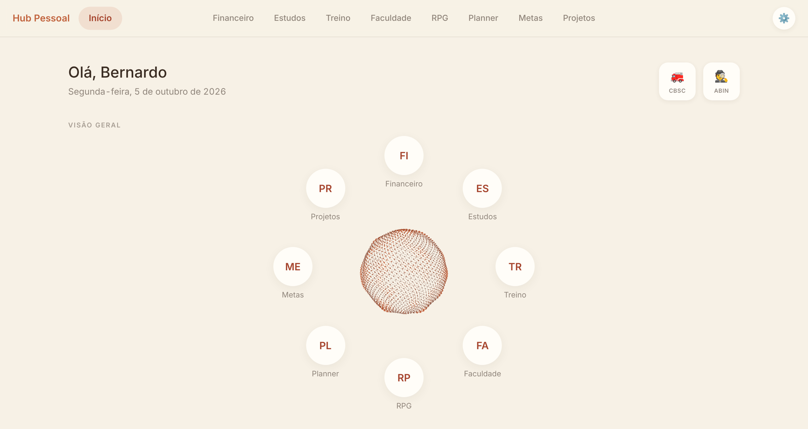
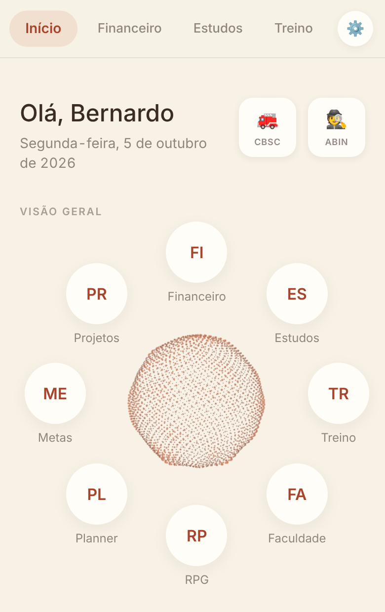
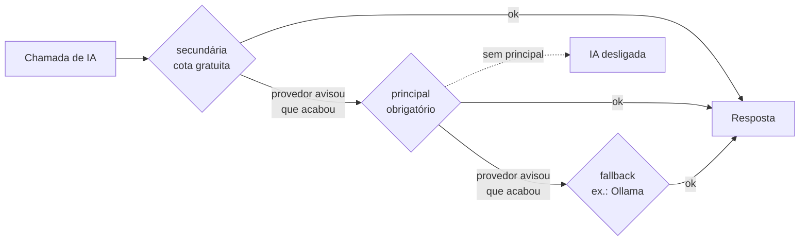
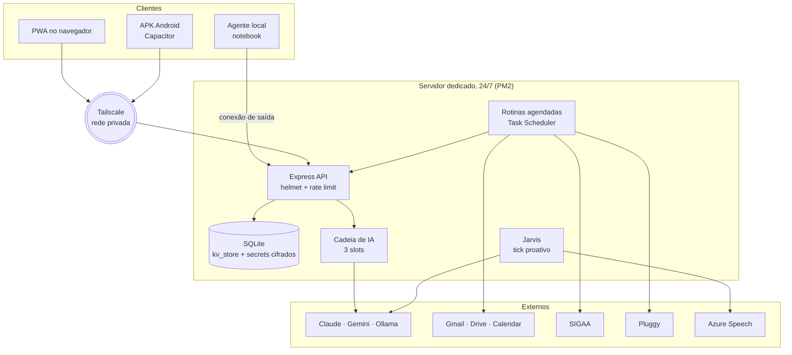

# Hub Pessoal

App pessoal que junta finanças, estudos, faculdade, planner, treino e metas num lugar só. Roda como PWA no navegador e como app Android, conversando com um servidor que fica ligado o tempo todo num PC em casa.

<p align="center">
  
  
  
  
  
  
</p>

<p align="center">
  
  &nbsp;
  
</p>

## Sobre

Comecei o projeto para parar de usar um app diferente para cada coisa. Hoje ele é o que uso no dia a dia: são cerca de 69 mil linhas de TypeScript e JavaScript, 8 módulos e mais de 50 rotas de API. O servidor roda num PC dedicado com PM2, e o celular acessa por Tailscale, então nada fica exposto na internet.

Também serve para eu praticar integração com IA, automação e arquitetura de um sistema maior do que os exercícios da faculdade.

## Módulos

| Módulo | O que tem |
| --- | --- |
| Estudos | Simulados com cronômetro, caderno de erros, questões e flashcards com repetição espaçada (SM-2), resumos com tutor e geração de conteúdo a partir dos sub-tópicos em que mais erro |
| Faculdade | Disciplinas, avaliações, notas e tarefas. Lê PDFs dos materiais e sincroniza com o SIGAA (via Puppeteer). Mostra o que está perto do prazo |
| Financeiro | Dashboard do mês, importação de faturas, categorização por regras, orçamentos, cartões, relatórios e um resumo mensal feito por IA |
| Planner | Rotina semanal, plano de sessões de estudo e detalhamento de cada sessão |
| Projetos | Projetos, frentes, tarefas, bugs e decisões, com visualizador de arquivos e histórico de atividade |
| Treino | Registro de treinos e requisitos de teste físico |
| Metas | Objetivos com acompanhamento de progresso |
| RPG | Personagem, atributos e campanhas ligados à produtividade |

## Jarvis

O Jarvis é um assistente que usa a API da Anthropic e tem cerca de 50 ferramentas para ler e alterar dados do Hub. Ele consulta a agenda da faculdade, lança uma transação, cria um flashcard, reagenda uma sessão de estudo, busca e-mails e arquivos no Drive e controla mídia no computador. Também fala (voz neural em português pelo Azure) e pode chamar a atenção por conta própria.

Algumas decisões que tomei nele:

- A iniciativa própria passa antes por uma checagem simples, sem IA. O modelo só é chamado se essa checagem liberar, para não gastar token à toa.
- Toda chamada passa por um único ponto que calcula o custo (incluindo cache) e soma o total do mês.
- A persona e as regras ficam num bloco fixo com cache. O contexto que muda (hora, números do dia, memória) vai num bloco separado.
- Tudo que o Jarvis altera vai para um log, e os itens da caixa de entrada têm botão de desfazer. Ações em lote, como recategorizar várias transações, começam em dry-run e só executam depois que eu confirmo.
- O agente que roda no notebook abre a conexão para o servidor, em vez de ficar escutando numa porta. Assim funciona em qualquer rede, até no 4G, sem mexer no roteador. Ele só executa comandos de uma lista fechada.

## Configuração da IA

Não existe provedor fixo. Em Configurações → IA dá para definir três slots, e cada chamada tenta nesta ordem:



A cadeia começa pela cota gratuita para que as gerações automáticas (SIGAA, briefing, plano semanal) não gastem o crédito pago que eu vou querer usar depois. Ela só passa para o próximo slot quando o provedor diz que a cota acabou. Tentar prever isso por conta própria daria errado, porque os limites mudam sem aviso.

Os erros são classificados pela mensagem antes do código HTTP, porque "saldo esgotado" e "chave inválida" chegam com o mesmo status. Para adicionar um provedor novo basta criar um arquivo em `server/ai/adapters/`.

## Arquitetura



## Problemas que apareceram

Alguns bugs e erros de projeto que acabaram virando regra no código:

- A chave do Gemini já ficou no `kv_store`, que é entregue inteiro ao navegador. Hoje as chaves ficam numa tabela `secrets`, cifradas com AES-256-GCM, e a tela só descobre se existe uma chave, sem nunca receber o valor.
- Por um tempo o Ollama era o último fallback incondicional. Toda falha do Gemini tentava `localhost` e terminava em `fetch failed`, o que escondeu por semanas que o saldo tinha acabado. Agora ele só entra se for configurado.
- Eu detectava "estou rodando no APK" olhando `window.Capacitor`, que existe em qualquer ambiente. Resultado: o `npm run dev` passou a escrever no banco de produção sem aviso. Troquei por `isNativePlatform()`.
- O popup do `<select>` nativo é desenhado pelo sistema operacional e ignora o design system. Troquei os 27 usos por um componente próprio.
- Um ciclo de importação no módulo do Jarvis só quebrava dependendo da ordem em que os arquivos carregavam. Resolvi movendo o log de auditoria para um módulo separado.

## Visual

Fundo quente (`#F7F1E6`), cartões flutuantes, terracota (`#C1633D`) como cor de destaque e a fonte Inter empacotada para funcionar offline. Todas as cores vêm de variáveis `--hub-*`, e componentes como `Card`, `ModuleHeader`, `Select` e `DateField` são compartilhados entre os módulos.

## Stack

| Camada | Tecnologias |
| --- | --- |
| Frontend | React 19, TypeScript, Vite 7, Tailwind CSS, React Router 7, three.js (orbe do Jarvis), KaTeX |
| Backend | Node 22, Express, SQLite (`node:sqlite`), Zod, helmet, express-rate-limit |
| IA | Anthropic SDK (Claude), Gemini, Ollama, Azure Speech |
| Integrações | Gmail, Drive e Calendar, SIGAA (Puppeteer), Pluggy, Web Push |
| Entrega | PWA com service worker, APK Android (Capacitor), PM2, Windows Task Scheduler |

## Estrutura

```
src/
  app/        entrada, layout e rotas raiz
  core/       ai, storage, alerts, navigation, theme, config, push, backup
  modules/    finance, study, college, planner, fitness, goals, rpg, projects
  shared/     componentes, hooks e utilitários
server/
  ai/         cadeia de slots e adaptadores de provedor
  jarvis/     agente, ferramentas, orçamento, auditoria e memória
scripts/      sincronizações, rotinas agendadas e verificações (*-check.js)
agent/        agente local do Jarvis
android/      projeto Capacitor
```

## Como rodar

Precisa de Node 22 ou mais novo.

```bash
npm install
cp .env.example .env     # preencha CREDENTIALS_ENCRYPTION_KEY (explicação no arquivo)

npm run dev:full         # Vite + API
npm run check            # tsc -b
npm run build            # tsc + vite build
npm test                 # scripts/*-check.js
```

A IA só liga depois que um slot principal é configurado em Configurações → IA. As chaves ficam cifradas no servidor. Para usar fora do computador, defina `HUB_BACKEND` e `VITE_HUB_BACKEND` no `.env` com o endereço do servidor no seu tailnet.

## Segurança

- Credenciais, tokens e dados em trânsito ficam fora do repositório. Em `.env.example` aparecem só os nomes das variáveis.
- As chaves de IA são cifradas no banco e nunca voltam para o navegador.
- O agente local só executa comandos de uma lista fechada.
- A IA é consultiva. Ações destrutivas ou em lote passam por dry-run e confirmação.
- O backend roda localmente, sem servidor remoto.

## Autor

Bernardo dos Santos Ferreira, estudante de Ciência da Computação no IFSC (Lages/SC).
[GitHub](https://github.com/bernardo-dos-santos) · [LinkedIn](https://www.linkedin.com/in/bernardo-dos-santos-ferreira-221603356)

Projeto pessoal publicado como portfólio, sem licença de reutilização definida.
